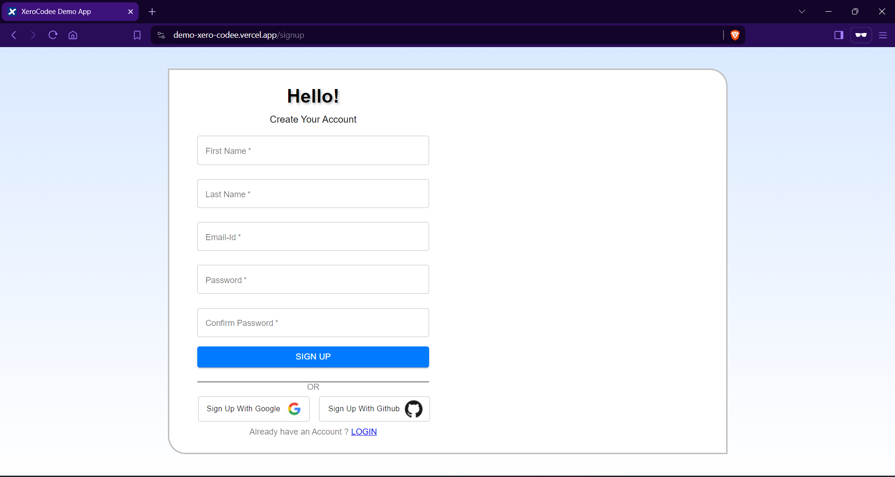

# XeroCodee Demo Project

## Description

This project is a web application designed to provide a user-friendly interface for users to sign up and sign in. The application supports authentication through email/password as well as OAuth providers like Google and GitHub. The project uses React for the frontend and integrates with a backend API for user authentication and data management using appwrite.

## Deployment Link - https://demo-xero-codee.vercel.app/

Note : All backend functionalities are not available in the deployed version of this project

## Demo

Demo video link - https://drive.google.com/file/d/1ur9_dRdQeFcTEZLWGWgM1EczEIqmeYW0/view?usp=sharing
<video width="600" controls>
  <source src="DemoXeroCodee.mp4" type="video/mp4">
  The browser does not support the video tag.
</video>



## Features

- User Authentication (Sign up and Sign in)
- OAuth Integration (Google and GitHub)
- Responsive Design
- Smooth User Onboarding

## Technologies Used

- React
- Material-UI
- OAuth (Google, GitHub)
- Appwrite
- MERN

## Getting Started

Follow these steps to set up the project locally.

### Prerequisites

- Node.js (v12 or higher)
- npm (v6 or higher) or yarn (v1.22 or higher)
- Backend API running on `http://localhost:5000`
- git (if git is not installed download the zip folder from the link and extract it)

### Installation

1. **Clone the repository:**

   ```bash
   git clone https://github.com/rajanraj2/Nextjs.git
   ```

   ```bash
   cd nextjs/react-project2/client
   ```

2. **Install dependencies of Frontend:**

   ```bash
   npm install
   ```

   # or

   ```bash
   yarn install
   ```

3. **Run the Frontend:**

    ```bash
    npm start
    ```
4. **Install dependencies of Backend:**
move to the server folder if the current directory is client
    ```bash
    cd ../server
    ```

    ```bash
    npm install
    ```
5. **Run the Backend:**
    ```bash
    node server.js
    ```


3. **(Optional for now) Create a `.env` file in the root directory and add your environment variables:** 
    ```bash
    REACT_APP_API_URL=http://localhost:5000/api
    ```


**Open your browser and navigate to:**
    ```
    http://localhost:3000
    ```

### Project Structure

````

├── client
│ ├── src
│ ├──├──assets
│ ├──├──pages
│ ├──├──App.js
│ ├──├──index.js
│ ├──├── ...
│ └── ...
├── server
│ ├── controllers
│ ├── models
│ ├── router
│ ├── server.js
│ └── ...
└── README.md

````

### Backend API

Ensure that the backend API is running and accessible at `http://localhost:5000`. The API should have endpoints for:

- User registration (`POST /api/signup`)
- User login (`POST /api/signin`)
- OAuth authentication (`GET /api/auth/google`, `GET /api/auth/github`)

### Environment Variables (Optional for now)

The application uses environment variables to configure the API URL. Ensure that the `.env` file contains the correct URL for the backend API.

```env
REACT_APP_API_URL=http://localhost:5000/api
````

## Contact

For any questions or suggestions, please contact:

- Rajan Raj
- [Email Address](mailto:rajanraj253545@gmail.com)
- [GitHub](https://github.com/rajanraj2)

---
